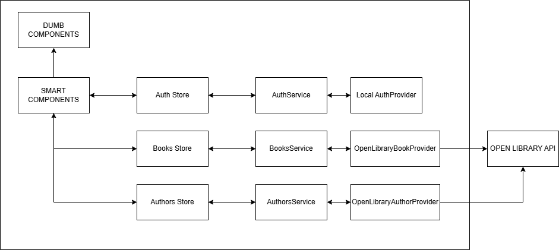

# The Folio Open Library

Welcome to **The Folio Open Library** - an Angular project built around the [Open Library API](https://openlibrary.org/developers/api).

## Tech Stack

- Angular (generated with [Angular CLI](https://github.com/angular/angular-cli), v21.1.4)
- Tailwind CSS
- RxJS + Signals

## Getting Started

Install dependencies

```bash
npm i
```

Start the local development server:

```bash
npm run start
```

### Demo Credentials (Development Only)

For quick local testing:

- Email: `admin@test.com`
- Password: `password`

## Project Intent

This project focuses on a few clear principles:

- Keep it simple
- Build with Angular and Tailwind CSS
- Use a modular architecture to separate business logic from UI
- Use facade and mapper patterns for services/providers
- Use a store-service pattern for state management (without NgRx or heavy state managers)
- Use readonly signals for selectors/getters and private signals for internal state
- Separate components into smart and dumb roles
- Keep the app i18n-ready

## Architecture Overview



- **Dumb components**: pure UI rendering
- **Smart components**: orchestration and dependency injection
- **Store**: state handling with RxJS/signals
- **Services**: business logic layer
- **Providers**: raw HTTP calls + mapping

## Current Features

- Authentication (demo/local flow)
- Search
- Book and author details
- Favorites

## Next Improvements

- Missing feature : in author detail page : author's books list
- Automated tests
- Stronger form validation
- Accessibility improvements
- Real authentication provider
- The JWT token is stored in the localstorage for now, move to cookies to avoid theft
